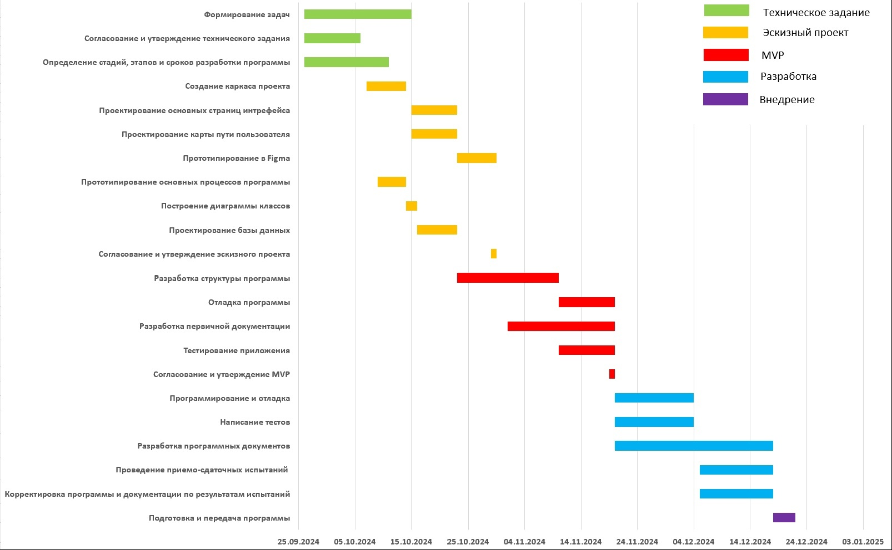

# План проекта

1. Техническое задание 26.09-15.10
   - Формирование задач 26.09-11.10
   - Согласование и утверждение технического задания 26.09 - 06.10
   - Определение стадий, этапов и сроков разработки программы 26.09 - 11.10

2. Эскизный проект
   - Создание каркаса проекта 07.10-14.10
   - Интерфейс 15.10 - 30.10
       - Проектирование основных страниц 15.10 - 23.10
       - Карта пути пользователя 15.10 - 23.10
       - прототипирование в Figma 23.10 - 30.10

   - Бэкенд 09.10 - 23.10
       - Прототипирование основных процессов программы 09.10 - 14.10
       - Построение диаграммы классов 14.10 - 16.10
       - Проектирование базы данных 16.10 - 23.10

   - Согласование и утверждение эскизного проекта  29.10 - 30.10

3. MVP 23.10-20.11
    - Разработка структуры программы 23.10 - 10.11
    - Отладка 10.11 - 20.11
    - Разработка первичной документации 01.11 - 20.11
    - Тестирование приложения 10.11 - 20.11
    - Согласование и утверждение MVP 19.11 - 20.11

4. Разработка
    - Программирование и отладка 20.11 - 04.12
    - Написание тестов 20.11 - 04.12 
    - Разработка программных документов - 20.11 - 18.12
    - Проведение приемо-сдаточных испытаний 05.12 - 18.12
    - Корректировка программы и документации по результатам испытаний 05.12 - 18.12

5. Внедрение
    - Подготовка и передача программы 18.12 - 22.12

Диаграмма ганта проекта 

